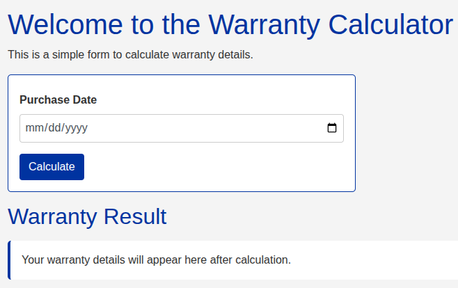

# Warranty Calculator

This is a browser-based tool that helps users calculate warranty expiration dates based on a selected purchase date. It displays standard expiration periods such as 1, 3, 5, and 25 years from the chosen date.

---

## 🧾 How It Works

Users input a **purchase date**, and the app instantly displays the expiration dates for various standard warranty durations. It helps quickly answer questions like:

> “When will my 3-year warranty expire?”

---

## 💻 Live Demo

[View Live](https://timlp79.github.io/warranty_calculator2/)

---

## 📸 Screenshot



---

## 🛠 Technologies Used

- **HTML5**
- **CSS3** (Bootstrap 5 for styling)
- **JavaScript** (Native JS for date handling and DOM manipulation)

---

## 📂 File Structure

```bash
warranty-calculator/
├── index.html       # Main HTML file
├── ./css/styles.css       # Custom CSS styles (optional)
├── ./js/app.js        # JavaScript logic to handle date calculations
├── ./assets/screenshot.png
└── README.md
